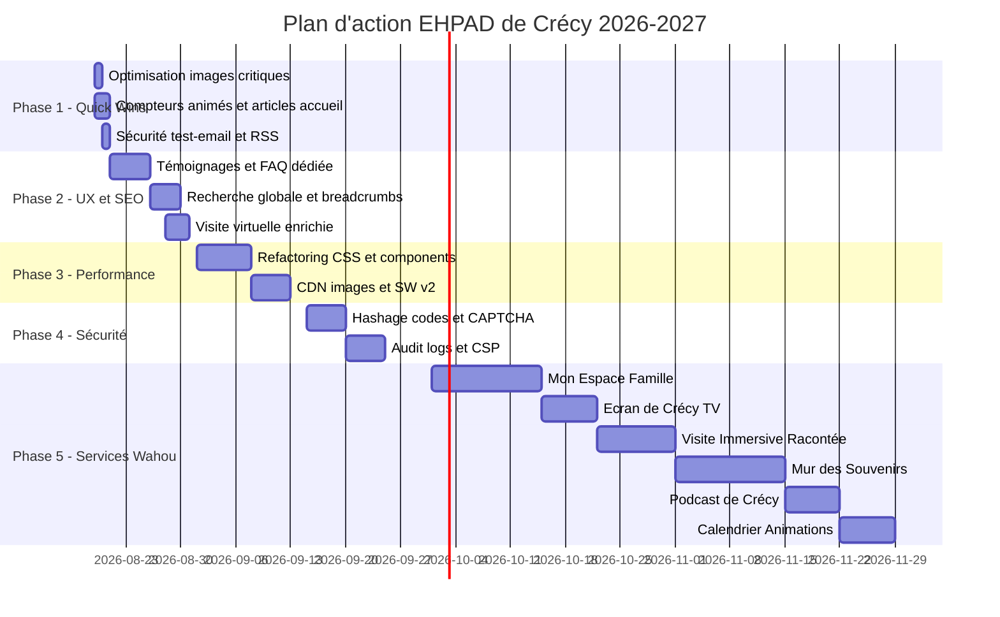

# 🔍 Audit Complet & Plan d'Action Visionnaire — EHPAD de Crécy

**Date :** 18 août 2026
**Périmètre :** Analyse intégrale du site [ehpadcrecy.netlify.app](https://ehpadcrecy.netlify.app) — code source, architecture, UX, design, SEO, accessibilité, sécurité, performances et services.

---

## Table des matières

1. [Synthèse exécutive](#1-synthèse-exécutive)
2. [Audit technique](#2-audit-technique)
3. [Audit UX & Design](#3-audit-ux--design)
4. [Audit SEO & Visibilité](#4-audit-seo--visibilité)
5. [Audit Sécurité & RGPD](#5-audit-sécurité--rgpd)
6. [Audit Accessibilité (RGAA)](#6-audit-accessibilité-rgaa)
7. [Audit Performance](#7-audit-performance)
8. [Plan d'action détaillé (5 phases)](#8-plan-daction-détaillé)
9. [🚀 Nouveaux services « Effet Wahou »](#9-nouveaux-services--effet-wahou-)
10. [Calendrier prévisionnel](#10-calendrier-prévisionnel)

---

## 1. Synthèse exécutive

### Le site aujourd'hui

| Indicateur | Valeur |
|---|---|
| **Pages publiques** | ~45 (statiques, export Next.js 16 + React 19) |
| **Fonctions serverless** | 15 Netlify Functions |
| **PWA** | ✅ Installable, page hors-ligne |
| **Chatbot IA** | ✅ Llama 3.2 + Speech-to-Text + TTS |
| **Accessibilité** | 100 % RGAA 4.1.2 (84/84 critères) |
| **Poids déploiement** | ~495 Mo (dont 198 Mo de photos) |
| **Framework CSS** | Tailwind CSS v4 + CSS personnalisé |
| **Analytics** | GoatCounter (sans cookies) |
| **CI/CD** | GitHub Actions + Netlify |

### Forces ✅

- Design premium avec glassmorphism, animations Framer Motion et palette chaleureuse
- Chatbot IA fonctionnel avec voix (STT/TTS)
- Accessibilité exemplaire (100 % RGAA)
- PWA installable
- Système d'administration complet (galerie, blog, gazette, postier, résidents)
- Visite virtuelle 360°
- Simulateur de tarifs interactif

### Faiblesses ⚠️

- Poids excessif du déploiement (495 Mo)
- 58/86 composants hydratés client-side (surchauffe JS)
- Framer Motion encore dans 44 fichiers (bundle lourd)
- Service Worker basique (pas de stratégie de cache avancée)
- Pas de mode multilingue
- Manque d'interactivité famille (portail limité au Postier)
- Pas de dashboard analytics interne
- Absence de notifications push
- Image `logo.png` de 1,4 Mo (non optimisée)
- `Image1.png` de 2,4 Mo sur la page d'accueil (non optimisée)

---

## 2. Audit technique

### Architecture

| Composant | Technologie | Verdict |
|---|---|---|
| Framework | Next.js 16 (export statique) | ✅ Bon choix pour hébergement Netlify gratuit |
| UI | React 19 + Framer Motion | ⚠️ Framer Motion surchargé (44 fichiers) |
| CSS | Tailwind v4 + CSS custom | ✅ Bon équilibre |
| Backend | Netlify Functions (Node.js) | ✅ Serverless adapté |
| Auth | Netlify Identity | ✅ Simple et gratuit |
| IA | Cloudflare Workers AI (Llama 3.2) | ✅ Gratuit, performant |
| Analytics | GoatCounter | ✅ Respectueux vie privée |
| Média | Sharp (build time) | ✅ Optimisation automatique |

### Dettes techniques identifiées

| # | Problème | Impact | Priorité |
|---|---|---|---|
| T1 | `globals.css` de **1 598 lignes** (40 Ko) — monolithique, difficile à maintenir | Maintenabilité | 🟡 Moyenne |
| T2 | `services-data.ts` de **489 lignes** (33 Ko) — données + logique mélangées | Maintenabilité | 🟡 Moyenne |
| T3 | `CourrierManager.tsx` de **48 Ko** et `GazetteManager.tsx` de **52 Ko** — composants monolithiques | Maintenabilité | 🟡 Moyenne |
| T4 | `Chatbot.tsx` de **28 Ko** — trop de logique dans un seul fichier | Maintenabilité | 🟡 Moyenne |
| T5 | Duplication de styles (palettes de couleurs copiées dans IntroSection, AnimationPage, RecrutementPage) | DRY | 🟢 Faible |
| T6 | `any` TypeScript dans gazette, recrutement et animation | Typage | 🟢 Faible |
| T7 | `placehold.co` et `images.unsplash.com` toujours dans `next.config.ts` (non utilisés ?) | Nettoyage | 🟢 Faible |
| T8 | Pas de version lock du Service Worker (cache `v1` statique) | Cache | 🟡 Moyenne |

### Recommandations code

1. **Découper `globals.css`** en modules thématiques : `base.css`, `typography.css`, `buttons.css`, `components.css`, `animations.css`
2. **Migrer `services-data.ts`** vers un fichier JSON + un fichier de types séparé
3. **Découper les composants admin** en sous-composants (liste, formulaire, aperçu)
4. **Supprimer les `remotePatterns` inutilisés** de `next.config.ts`
5. **Versionner le Service Worker** avec un hash de build

---

## 3. Audit UX & Design

### Page d'accueil

| Élément | Score | Commentaire |
|---|---|---|
| Hero section | ⭐⭐⭐⭐⭐ | Magnifique : parallaxe, glassmorphism, animations subtiles |
| Navigation | ⭐⭐⭐⭐ | Claire et accessible, mais pas de mega-menu visuel |
| Features | ⭐⭐⭐⭐ | Bon contenu, illustration trop grande en desktop |
| Valeurs | ⭐⭐⭐⭐⭐ | Animations interactives élégantes |
| CTA final | ⭐⭐⭐⭐ | Bon appel à l'action, mais un peu générique |

### Points d'amélioration UX

| # | Problème | Solution proposée |
|---|---|---|
| U1 | **Pas de témoignages** familles/résidents | Ajouter un carrousel de citations avec photo floue/anonymisée |
| U2 | **Pas de compteurs animés** | Ajouter : « 63 résidents · 45+ soignants · 150+ ans d'histoire · 100% aide sociale » |
| U3 | **Pas de section « Actualités »** sur l'accueil | Ajouter les 3 derniers articles du blog sous les valeurs |
| U4 | **Footer sans réseaux sociaux** | Ajouter les liens Facebook (page officielle) et compte officiel si existant |
| U5 | **Page Familles trop utilitaire** | Transformer en véritable « Espace Familles » avec infos pratiques, horaires, FAQ dédiée |
| U6 | **Pas de breadcrumbs visuels** sur toutes les pages | Harmoniser la navigation avec des fils d'Ariane visuels |
| U7 | **Pas de mode sombre complet** | Le toggle existe mais le mode sombre est partiel (certaines pages non couvertes) |
| U8 | **Pas de barre de recherche** | Ajouter une recherche globale (locale, index JSON) |
| U9 | **Visite virtuelle sous-exploitée** | Seulement 1 panorama 360° (le jardin) — enrichir avec salon, chambre, couloir, salle à manger |
| U10 | **Page recrutement sans formulaire de candidature en ligne** | Ajouter un formulaire avec upload CV |

---

## 4. Audit SEO & Visibilité

### Points forts SEO ✅

- `robots.txt` et `sitemap.xml` générés dynamiquement
- Données structurées `NursingHome`, `BreadcrumbList`, `FAQPage`, `BlogPosting`
- Métadonnées Open Graph et Twitter Cards sur les pages principales
- Canoniques en place
- GoatCounter sans cookies

### Lacunes SEO

| # | Problème | Impact | Solution |
|---|---|---|---|
| S1 | **Pas de Google Business Profile lié** | Acquisition locale critique | Créer/optimiser la fiche Google Business et lier le site |
| S2 | **URL non descriptives** (`/hebergement` au lieu de `/tarifs-hebergement-ehpad-crecy`) | SEO on-page | Renommer les routes avec des slugs optimisés |
| S3 | **Pas de page FAQ dédiée** | Featured snippets | Créer `/faq` avec schéma FAQPage complet |
| S4 | **Pas de blog SEO-optimisé** | Long-tail keywords | Produire du contenu régulier : « Quelles aides pour entrer en EHPAD ? », « Comment préparer l'admission ? » |
| S5 | **Images sans attribut `alt` descriptif** dans la galerie | Image SEO | Les images de galerie ont `alt=""` — ajouter des descriptions |
| S6 | **Pas de liens locaux** | SEO local | Ajouter des liens vers la mairie, office de tourisme, ARS |
| S7 | **Pas de page de plan du site visible** | Navigation | Ajouter un `/plan-du-site` HTML accessible |
| S8 | **Sitemap `lastModified` statique** (toujours 16 août 2026) | Fraîcheur | Dynamiser avec la date du dernier build |
| S9 | **Pas de flux RSS** pour le blog | Syndication | Générer un flux RSS/Atom automatique |

---

## 5. Audit Sécurité & RGPD

### Points traités ✅

- CSP, `X-Content-Type-Options`, `Referrer-Policy` et `Permissions-Policy` en place
- Rate-limiting sur le chatbot IA
- Sanitization HTML de la Gazette
- Rôle `admin` vérifié sur les fonctions critiques
- Commits anonymisés pour le Postier
- Conservation limitée à 30 jours

### Risques résiduels

| # | Risque | Criticité | Recommandation |
|---|---|---|---|
| R1 | **Codes du Postier en clair** dans `residents.json` | 🔴 Haute | Hasher les codes (bcrypt) et valider côté serveur |
| R2 | **Pas de CAPTCHA** sur les formulaires publics | 🟡 Moyenne | Ajouter un honeypot + reCAPTCHA invisible |
| R3 | **`test-email.ts` exposé** sans authentification | 🔴 Haute | Protéger par rôle admin ou supprimer |
| R4 | **Pas de politique de mots de passe** pour Netlify Identity | 🟡 Moyenne | Documenter les exigences |
| R5 | **Pas de journal d'audit** des actions admin | 🟡 Moyenne | Logger les actions sensibles dans un fichier JSON |
| R6 | **CSP avec `'unsafe-inline'`** pour scripts et styles | 🟡 Moyenne | Migrer vers des nonces ou des hashes |

---

## 6. Audit Accessibilité (RGAA)

### État actuel : 100 % conforme (84/84 critères)

> [!TIP]
> Le site est exemplaire en accessibilité. Les recommandations ci-dessous sont des améliorations au-delà de la conformité.

### Améliorations recommandées

| # | Amélioration | Détail |
|---|---|---|
| A1 | **Test VoiceOver** (macOS/iOS) | Seuls les tests NVDA ont été réalisés |
| A2 | **Test TalkBack** (Android) | Public âgé potentiellement sur tablette Android |
| A3 | **Mode grand contraste renforcé** | Le toggle existe mais le mode pourrait aller plus loin (tailles de police) |
| A4 | **Vocalisation automatique** des contenus clés | Utiliser TTS natif pour lire automatiquement les menus, tarifs, etc. |
| A5 | **Facile à Lire et à Comprendre (FALC)** | Proposer une version FALC de la page admissions/tarifs |

---

## 7. Audit Performance

### Mesures observées

| Métrique | Valeur | Cible | Verdict |
|---|---|---|---|
| Export total | 495 Mo | < 300 Mo | 🔴 À optimiser |
| Photos galerie | 198 Mo (102 photos) | < 50 Mo | 🔴 À optimiser |
| JavaScript total | ~1,41 Mo | < 1 Mo | 🟡 À surveiller |
| `logo.png` | 1,4 Mo | < 50 Ko | 🔴 Critique |
| `Image1.png` | 2,4 Mo | < 200 Ko | 🔴 Critique |
| `jardin-360.jpg` | 13,5 Mo | Existant WebP 1,2 Mo | ✅ Géré |
| Composants client | 58/86 | < 30/86 | 🟡 À réduire |
| Framer Motion | 44 fichiers | < 15 fichiers | 🟡 À réduire |

### Optimisations critiques

| # | Action | Gain estimé |
|---|---|---|
| P1 | **Convertir `logo.png`** en WebP/AVIF (1,4 Mo → ~30 Ko) | ~1,37 Mo |
| P2 | **Convertir `Image1.png`** en WebP (2,4 Mo → ~150 Ko) | ~2,25 Mo |
| P3 | **Supprimer les doublons stricts** restants | ~27 Mo |
| P4 | **Migrer plus de composants** vers Server Components | -200 Ko JS |
| P5 | **Remplacer Framer Motion** par CSS animations là où c'est simple | -100 Ko JS |
| P6 | **Implémenter le lazy-loading** des routes non critiques | Meilleur LCP |
| P7 | **Service Worker intelligent** (cache-first pour assets, network-first pour HTML) | Offline robuste |
| P8 | **Image CDN** (Cloudflare Images ou imgix) pour transformations à la volée | -80 % taille images |

---

## 8. Plan d'action détaillé

### Phase 1 — Optimisations immédiates (1-3 jours)

> [!IMPORTANT]
> Actions à fort impact, sans risque, réalisables immédiatement.

| # | Action | Fichiers | Effort |
|---|---|---|---|
| 1.1 | Convertir `logo.png` et `Image1.png` en WebP optimisé | `public/images/` | 30 min |
| 1.2 | Supprimer les remotePatterns inutilisés de `next.config.ts` | `next.config.ts` | 5 min |
| 1.3 | Ajouter des compteurs animés sur l'accueil (63 résidents, 150+ ans, etc.) | `HeroSection.tsx` / `FeaturesSection.tsx` | 2h |
| 1.4 | Ajouter les 3 derniers articles du blog sur la page d'accueil | `page.tsx` + nouveau composant `LatestPosts.tsx` | 2h |
| 1.5 | Dynamiser la date `lastModified` du sitemap | `sitemap.ts` | 15 min |
| 1.6 | Protéger `test-email.ts` par rôle admin | `netlify/functions/test-email.ts` | 30 min |
| 1.7 | Ajouter un flux RSS pour le blog | `src/app/blog/rss.xml/route.ts` | 1h |

---

### Phase 2 — Améliorations UX & SEO (1-2 semaines)

| # | Action | Détail |
|---|---|---|
| 2.1 | **Carrousel de témoignages** | Citations anonymisées de familles avec avis et note, effet parallaxe |
| 2.2 | **Page FAQ dédiée** `/faq` | Regrouper toutes les questions (admission, vie quotidienne, tarifs, visites) avec schéma FAQPage |
| 2.3 | **Barre de recherche globale** | Index JSON client-side avec fuzzy search, raccourci `Ctrl+K` |
| 2.4 | **Breadcrumbs visuels** sur toutes les pages | Composant réutilisable `<Breadcrumbs>` |
| 2.5 | **Enrichir la visite virtuelle** | Ajouter 3-4 panoramas 360° (salon, chambre, salle à manger, entrée) |
| 2.6 | **Formulaire de candidature** en ligne | Upload CV, lettre de motivation, champ libre |
| 2.7 | **Page plan du site** `/plan-du-site` | Navigation HTML accessible |
| 2.8 | **Liens locaux dans le footer** | Mairie, ARS, office de tourisme, transports |

---

### Phase 3 — Performance & code (2-4 semaines)

| # | Action | Détail |
|---|---|---|
| 3.1 | **Découper `globals.css`** | 5 fichiers modulaires |
| 3.2 | **Migrer les animations simples** de Framer Motion vers CSS | Cibler : fade-in, slide-up, scale — garder Framer pour les interactions complexes |
| 3.3 | **Convertir 15+ composants** en Server Components | Pages informatives : equipe, histoire, admissions, blog listing |
| 3.4 | **Service Worker v2** intelligent | Stratégie cache-first pour assets, network-first pour HTML, pre-cache des routes clés |
| 3.5 | **Implémenter un CDN image** | Cloudflare Images (gratuit 100K transforms/mois) ou imgix |
| 3.6 | **Notifications push** | Web Push API pour alerter les familles (nouvelle gazette, événement, etc.) |
| 3.7 | **Mode sombre complet** | Couvrir toutes les pages et composants |

---

### Phase 4 — Sécurité renforcée (1-2 semaines)

| # | Action | Détail |
|---|---|---|
| 4.1 | **Hasher les codes Postier** | bcrypt + validation côté serveur |
| 4.2 | **CAPTCHA invisible** | honeypot + Cloudflare Turnstile (gratuit) sur contact et postier |
| 4.3 | **Journal d'audit admin** | Logger les actions sensibles (suppression, publication, modification résidents) |
| 4.4 | **CSP sans `unsafe-inline`** | Migrer vers des nonces avec middleware Next.js |
| 4.5 | **Politique de sécurité documentée** | PSSI simplifiée pour l'établissement |

---

### Phase 5 — Services « Effet Wahou » (voir section 9)

---

## 9. 🚀 Nouveaux services « Effet Wahou »

> [!NOTE]
> Ces propositions sont classées par impact et faisabilité. Chacune est conçue pour fonctionner **sans abonnement payant**, en utilisant les outils déjà en place (Cloudflare Workers AI gratuit, Netlify Functions, Web APIs natives).

---

### 🌟 Service 1 — « Mon Espace Famille » (Tableau de bord familial temps réel)

**Concept :** Un véritable portail privé pour chaque famille, accessible avec le code secret du résident, qui va bien au-delà du simple envoi de courrier.

**Fonctionnalités :**
- 📬 **Fil d'échanges** : historique des messages envoyés et confirmations de distribution
- 📸 **Album partagé** : les familles envoient des photos, l'animation partage les photos d'activités du résident
- 📅 **Calendrier d'activités** du résident (ateliers, sorties prévues)
- 🍽️ **Menu de la semaine** personnalisé (avec régimes spéciaux)
- 📊 **Bien-être du jour** : un simple emoji (😊 😐 😴) choisi par l'équipe d'animation
- 🔔 **Notifications** : alerte quand un message est distribué, quand une photo est ajoutée

**Effet wahou :** La famille se sent **connectée au quotidien** de son proche, même à distance. C'est le WhatsApp de l'EHPAD.

**Techno :** Netlify Functions + stockage JSON/GitHub + Web Push API. Zéro API payante.

---

### 🎭 Service 2 — « Mur des Souvenirs » (Mémoire interactive)

**Concept :** Une page vivante où résidents, familles et équipes partagent des souvenirs, anecdotes et photos d'autrefois de Crécy et de la vie à l'EHPAD.

**Fonctionnalités :**
- 🗺️ **Carte interactive de Crécy** : cliquer sur un lieu affiche les souvenirs associés (le marché, la collégiale, l'ancien hospice)
- 📖 **Chronologie interactive** : frise animée depuis 1868 avec photos d'archives, témoignages et anecdotes
- 🎙️ **Capsules audio** : les résidents racontent un souvenir (enregistrement micro in-app, 2 min max)
- 📝 **Contribution famille** : « Racontez-nous un souvenir de votre proche à Crécy »
- 🤖 **IA narrative** : Llama 3.2 reformule et structure les témoignages oraux en texte publié

**Effet wahou :** L'EHPAD devient **gardien de la mémoire collective** de Crécy. C'est un projet intergénérationnel unique.

**Techno :** Web Audio API (enregistrement), Cloudflare Llama 3.2 (transcription/reformulation), stockage statique.

---

### 🎬 Service 3 — « Visite Immersive Racontée »

**Concept :** Transformer la visite virtuelle 360° en une **expérience cinématographique** où les résidents eux-mêmes racontent chaque lieu.

**Fonctionnalités :**
- 🎧 **Narration vocale** : chaque panorama a un audio enregistré par un résident ou un soignant (« Ici, c'est le salon. Moi c'est Roger, j'y joue aux cartes tous les après-midi ! »)
- 🗺️ **Parcours guidé automatique** : la visite se déroule comme un film, avec transitions douces entre les panoramas
- 📍 **Points d'intérêt cliquables** : hotspots sur le panorama (« Cliquez sur le piano pour entendre Madeleine jouer ! »)
- 🎵 **Ambiance sonore** : sons d'oiseaux dans le jardin, musique douce au salon
- 📱 **Compatible casque VR** (WebXR) : pour les journées portes ouvertes

**Effet wahou :** Les familles découvrent l'EHPAD **comme si elles y étaient**, guidées par les voix de ceux qui y vivent. Aucun autre EHPAD ne fait ça.

**Techno :** Pannellum (déjà installé) + Web Audio API + hotspots JSON.

---

### 📺 Service 4 — « L'Écran de Crécy » (TV connectée salle commune)

**Concept :** Un dashboard web en mode plein écran, conçu pour être affiché sur la TV ou un écran dans la salle commune/le hall d'entrée.

**Fonctionnalités :**
- 🕐 **Horloge et date** en très gros (lisibilité à distance)
- ☀️ **Météo du jour** avec icônes XXL et conseil (« Beau temps ! Le jardin vous attend. »)
- 🍽️ **Menu du jour** avec photos appétissantes
- 🎨 **Activité en cours / prochaine**
- 🎂 **Anniversaires du jour** (avec confettis animés !)
- 📸 **Diaporama de la galerie** en fond
- 💌 **Nombre de cartes reçues** aujourd'hui
- 📰 **Dernière gazette** en miniature
- 🔄 **Rotation automatique** entre les sections toutes les 15 secondes

**Effet wahou :** L'écran anime la vie collective, informe sans effort et crée un **sentiment de communauté vivante**.

**Techno :** Page Next.js dédiée `/tv` en mode kiosque, auto-refresh, CSS Grid responsive pour grand écran.

---

### ⏳ Service 5 — « Capsule Temporelle Numérique »

**Concept :** Chaque résident ou famille peut créer une capsule de souvenirs numériques qui sera « ouverte » à une date choisie.

**Fonctionnalités :**
- 📝 **Rédiger une lettre** à soi-même, à sa famille ou à un proche
- 📸 **Ajouter des photos** et des enregistrements vocaux
- 📅 **Choisir une date d'ouverture** (anniversaire, fête, Noël, etc.)
- 🔒 **Scellée** jusqu'à la date : un compte à rebours animé
- ✉️ **Notification automatique** le jour de l'ouverture
- 🎁 **Effet surprise** : ouverture avec animation de sceau brisé et confettis

**Effet wahou :** C'est **émouvant et poétique**. Les résidents laissent une trace numérique pleine de tendresse pour leurs proches.

---

### 🌿 Service 6 — « Le Jardin Connecté »

**Concept :** Une page dédiée au jardin de l'EHPAD qui devient un **espace sensoriel numérique**.

**Fonctionnalités :**
- 🌡️ **Météo en temps réel** avec conseil jardinage adapté aux résidents
- 📸 **Time-lapse saisonnier** : une photo du jardin par semaine, assemblées en animation
- 🦋 **Découverte nature** : « Cette semaine au jardin » avec l'espèce d'oiseau ou de plante du moment (IA)
- 🎧 **Ambiance sonore du jardin** (enregistrement micro in-situ, 30 sec en boucle)
- 📝 **Carnet du jardinier** : l'équipe technique documente les plantations, les récoltes

**Effet wahou :** Le jardin prend vie en ligne. Les familles voient les **saisons passer** à travers les yeux du jardinier.

---

### 🎙️ Service 7 — « Le Podcast de Crécy »

**Concept :** Un mini-podcast mensuel de 5-10 minutes enregistré directement dans le navigateur, édité par l'IA.

**Fonctionnalités :**
- 🎤 **Enregistrement in-app** (Web Audio API, micro navigateur)
- ✂️ **Montage IA** : Llama 3.2 transcrit, corrige et met en forme (titre, description, chapitres)
- 🎵 **Jingle automatique** : un son d'intro/outro généré ou choisi
- 📝 **Transcription accessible** automatique
- 📱 **Lecteur intégré** sur le site avec partage WhatsApp/Email
- 🗄️ **Archivage** : tous les épisodes accessibles avec recherche

**Épisodes types :**
- Interview d'un résident (« Racontez-nous votre métier d'autrefois »)
- Interview du chef cuisinier (« Le secret de la blanquette du mardi »)
- Coup de cœur du kiné (« 3 exercices pour rester en forme »)

**Effet wahou :** L'EHPAD a **sa propre radio**. Les familles écoutent en voiture. C'est unique et touchant.

---

### 📅 Service 8 — « Calendrier Interactif d'Animations »

**Concept :** Un vrai calendrier visuel interactif (style Google Calendar) remplaçant la liste statique d'activités.

**Fonctionnalités :**
- 📅 **Vue semaine / mois** avec code couleur par type d'activité
- 🖼️ **Chaque activité a une vignette photo** et une courte description
- 🔔 **Notification push** aux familles : « Demain, atelier peinture ! »
- 👨‍👩‍👧 **Inscription famille** : « Je viendrai participer à l'atelier pâtisserie de vendredi »
- 📊 **Compteur de participants** en temps réel
- 🎯 **Suggestions IA** : basées sur la météo et les retours (« Il fait beau, proposer une sortie au parc ? »)

**Effet wahou :** Les familles **s'inscrivent et participent** à la vie de l'EHPAD. C'est du vrai lien intergénérationnel.

---

### 🖼️ Service 9 — « Galerie Augmentée par l'IA »

**Concept :** L'IA enrichit automatiquement la galerie photos existante.

**Fonctionnalités :**
- 📝 **Légendes automatiques** : Llama 3.2 Vision décrit chaque photo uploadée
- 🏷️ **Tags automatiques** : « atelier peinture », « jardin », « musique », « cuisine »
- 🔍 **Recherche naturelle** : « Montre-moi les photos de Noël » (NLP + tags)
- 🎨 **Effets artistiques** : transformer une photo en style aquarelle/huile (pour la gazette)
- 📸 **Album du mois** : l'IA sélectionne les 10 meilleures photos et génère un diaporama

**Effet wahou :** La galerie devient **intelligente et vivante**, au lieu d'être un simple listing de photos.

---

### 🤝 Service 10 — « La Place du Village 2.0 » (Portail Bénévolat & Communauté)

**Concept :** Un espace numérique qui connecte l'EHPAD à son quartier et aux bénévoles.

**Fonctionnalités :**
- 🤝 **Annonces de bénévolat** : « Nous cherchons un lecteur le mercredi après-midi »
- 💛 **Mur des Mercis** : résidents, familles et équipes postent des remerciements publics
- 📣 **Événements ouverts** : « Goûter de Noël ouvert à tous — Inscrivez-vous ! »
- 🎓 **Partenariats** : liens avec les écoles (projet intergénérationnel, correspondance)
- 🏪 **Commerçants partenaires** : boulanger, fleuriste, coiffeur (avec offres résident)

**Effet wahou :** L'EHPAD **sort de ses murs** et s'ancre dans la vie de Crécy.

---

### 🌙 Service 11 — « Mode Crépuscule » (Interface familles nocturne)

**Concept :** Une interface spécialement conçue pour les familles qui consultent le site tard le soir (moment émotionnel fort).

**Fonctionnalités :**
- 🌙 **Activation automatique** entre 21h et 7h
- 🎨 **Palette apaisante** : tons bleu nuit, lumière tamisée, typographie douce
- 💬 **Message rassurant** : « [Prénom] a passé une bonne journée. L'équipe de nuit veille. »
- 🎵 **Ambiance sonore optionnelle** : musique douce/bruits de nature
- 📱 **Accès rapide** : téléphone d'urgence, dernier message du Postier, météo de demain

**Effet wahou :** C'est **bouleversant d'attention**. Les familles se sentent comprises dans leur inquiétude nocturne.

---

### 🎯 Service 12 — « Votre Avis Compte » (Enquête satisfaction ludifiée)

**Concept :** Remplacer les enquêtes papier par une micro-enquête web ludique et inclusive.

**Fonctionnalités :**
- 😊😐😟 **Vote par emojis** (accessible aux résidents, même avec troubles cognitifs)
- ❓ **1 question par semaine** affichée sur l'écran TV et sur le site
- 📊 **Résultats anonymisés** visibles publiquement
- 🏆 **Engagements publics** : « Vous avez dit → Nous avons fait » avec timeline d'actions
- 💬 **Commentaires libres** anonymisés

**Effet wahou :** La **démocratie participative** en EHPAD. Les familles voient que leur avis compte vraiment.

---

## 10. Calendrier prévisionnel

---

> [!IMPORTANT]
> **Priorisation recommandée pour les services « Wahou » :**
>
> 1. 📺 **L'Écran de Crécy** (TV) — Impact immédiat, visible chaque jour par les résidents et visiteurs
> 2. 🌟 **Mon Espace Famille** — Transforme la relation famille/EHPAD
> 3. 🎬 **Visite Immersive Racontée** — Différenciateur marketing unique
> 4. 📅 **Calendrier Interactif** — Engagement famille + bénévoles
> 5. 🎭 **Mur des Souvenirs** — Projet signature de l'établissement

---

> [!TIP]
> Tous ces services sont réalisables **sans aucun coût d'abonnement supplémentaire** grâce à :
> - Cloudflare Workers AI (Llama 3.2, gratuit)
> - Netlify Functions (gratuit jusqu'à 125K requêtes/mois)
> - Web APIs natives (Speech, Audio, Push, WebXR)
> - Stockage GitHub/JSON (gratuit)
